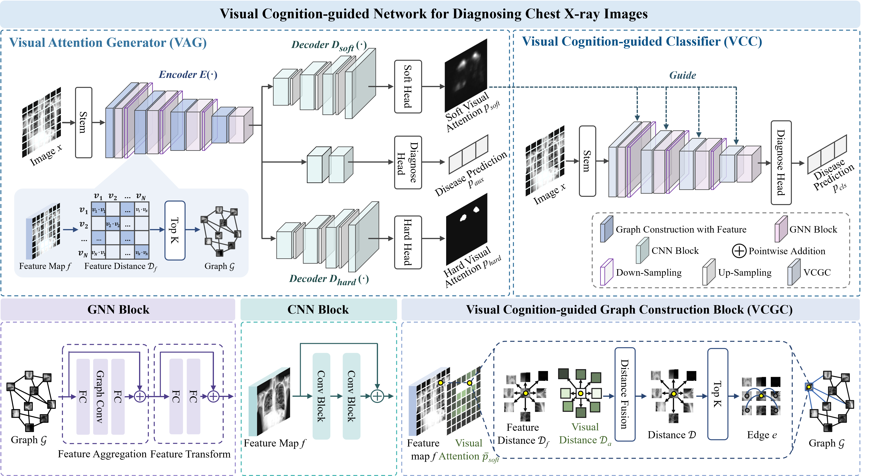
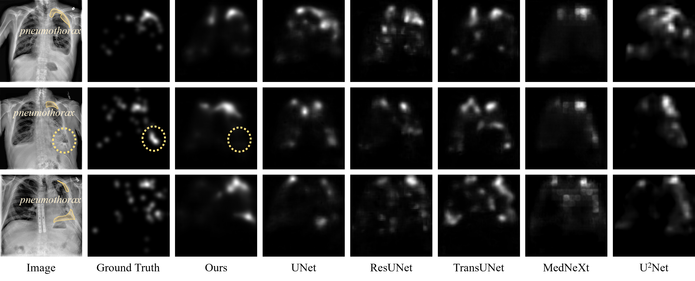

# Leveraging Radiologists’ Visual Cognition and Attention Patterns for Medical Image Diagnosis

This project contains the training and testing code for the paper, as well as the model weights trained according to our algorithm

## Methods

## Qualitative Results

## Model Weights
The download links and extraction codes for our model weights are as follows：
[Checkpoint](https://pan.baidu.com/s/1CxQ5CIH4ol3hBt_-Lk5ksg?pwd=7777) . 
 
Code: 7777 

## Dataset
* The SIIM-ACR dataset can be downloaded from  [SIIM-ACR](https://www.kaggle.com/c/siim-acr-pneumothorax-segmentation/data) .
* The gaze data for SIIM-ACR can be downloaded at [Gaze of SIIM-ACR](https://github.com/HazyResearch/observational) .
* The EGD-CXR dataset can be downloaded from [EGD-CXR](https://physionet.org/content/egd-cxr/1.0.0/) .

## Requirements
* python 3.8  
* torch 1.12.0 
* numpy 1.24.4 
* medpy 0.5.1 
* nibabel 5.2.1 
* pandas 2.0.3 
* scikit-image 0.21.0 
